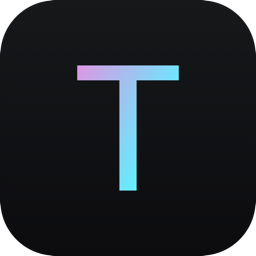
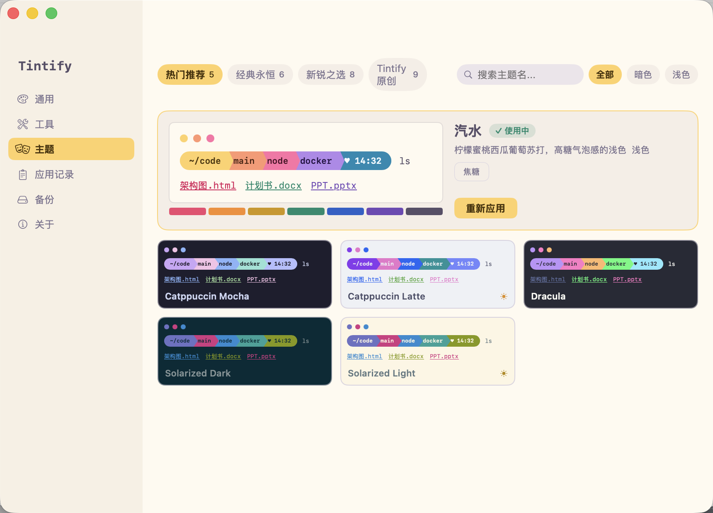
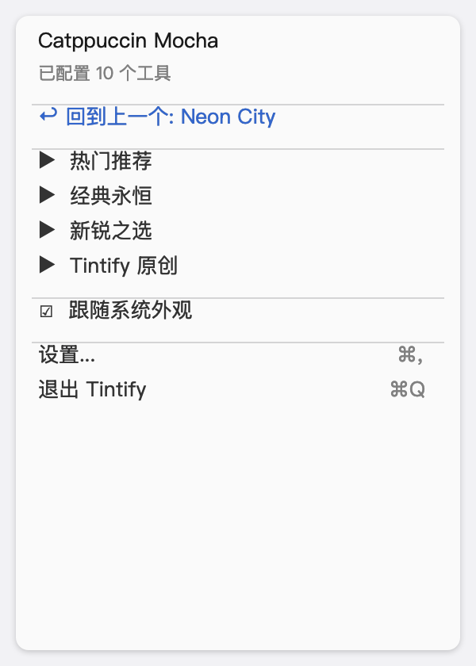
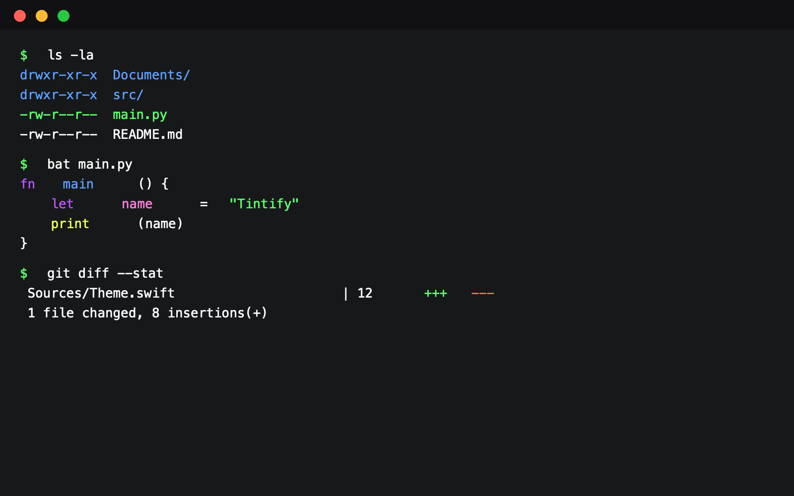

<p align="center">
  
</p>

<h1 align="center">Tintify</h1>

<p align="center">
  <strong>一键统一所有终端 CLI 工具的配色主题</strong>
</p>

<p align="center">
  <a href="https://github.com/notwin/Tintify/releases/latest"></a>
  
  
  <a href="LICENSE"></a>
</p>

---

Tintify 是一个 macOS 菜单栏应用，可以同时切换 **12 个终端工具**的配色主题。内置 **28 个精选主题**，覆盖从经典到前沿的热门配色方案，另有 9 个 Tintify 原创主题。

## 截图

<table>
  <tr>
    <td></td>
    <td></td>
  </tr>
  <tr>
    <td><em>设置窗口「主题即界面」— 整窗跟随当前主题配色，点卡即试穿</em></td>
    <td><em>菜单栏 — 分组子菜单，快速切换</em></td>
  </tr>
</table>

<details>
<summary>终端效果预览</summary>
<br>

<p><em>Neon City 主题下的终端效果 — ls、bat、git diff 的配色统一</em></p>
</details>

## 功能特性

- **一键切换** — 菜单栏选择主题，12 个工具同时更新
- **主题即界面** — 整个设置窗口用当前主题的色板上色，应用本身就是主题的活预览
- **点卡试穿** — 主题页点击任意卡片，整窗立刻换上那套配色但不动终端配置；Esc 还原，确认满意再应用
- **28 个内置主题** — 4 大分类：热门推荐 / 经典永恒 / 新锐之选 / Tintify 原创（9 个）
- **终端预览** — 每张主题卡就是一台迷你终端：胶囊提示符 + 彩色 ls
- **搜索与过滤** — 按名称搜索，按暗色/浅色筛选
- **跟随系统外观** — 自动切换深色/浅色主题
- **CLI** — `tintify set <主题>` 脚本化切换；`tintify doctor` 体检每个工具的配置是否实际生效（随 Homebrew cask 一起安装）
- **备份还原** — 自动备份配置文件，可一键还原
- **应用记录** — 每次切换的详细结果（成功/失败/跳过）
- **双语界面** — 简体中文 / English 跟随系统语言
- **自动更新** — 应用内检查并安装新版本（SHA256 校验）

## 支持的工具

| 工具 | 配置方式 | 即时生效 |
|------|---------|---------|
| [Ghostty](https://ghostty.org) | theme 配置行 | ✅ 自动检测 |
| [Starship](https://starship.rs) | palette 色板定义 | ✅ 下个 prompt |
| [bat](https://github.com/sharkdp/bat) | BAT_THEME 环境变量 | 新终端窗口 |
| [fzf](https://github.com/junegunn/fzf) | FZF_DEFAULT_OPTS 颜色 | 新终端窗口 |
| [delta](https://github.com/dandavison/delta) | git config syntax-theme | 下次 git diff |
| [eza](https://github.com/eza-community/eza) | YAML 主题文件 | ✅ 即时 |
| [lazygit](https://github.com/jesseduffield/lazygit) | gui.theme YAML | 下次打开 |
| [tmux](https://github.com/tmux/tmux) | 状态栏 + 边框颜色 | ✅ 自动 source |
| [Vim](https://www.vim.org) | 自动生成 colorscheme | 下次打开 |
| [WezTerm](https://wezterm.org) | color_scheme 配置行 | ✅ 自动检测 |
| otty | 主题文件 + config reload | ✅ 即时 |
| zsh-syntax-highlighting | 跟随终端 ANSI | ✅ 即时 |

## 内置主题

<table>
  <tr>
    <th>分类</th>
    <th>主题</th>
  </tr>
  <tr>
    <td><strong>热门推荐</strong></td>
    <td>Catppuccin (Mocha/Latte) · Dracula · Solarized (Dark/Light)</td>
  </tr>
  <tr>
    <td><strong>经典永恒</strong></td>
    <td>Monokai · One Dark/Light · Gruvbox (Dark/Light) · Nord</td>
  </tr>
  <tr>
    <td><strong>新锐之选</strong></td>
    <td>Tokyo Night (Night/Light) · Rosé Pine (Main/Dawn) · Kanagawa (Wave/Dragon/Lotus) · Everforest Dark</td>
  </tr>
  <tr>
    <td><strong>Tintify 原创</strong></td>
    <td>Neon City · 墨竹 · 极光 · 霓虹落日 · 磷光 · 墨与朱 · 琉璃 · 焦糖 · 汽水</td>
  </tr>
</table>

## 安装

### Homebrew (推荐)

```bash
brew tap notwin/tap
brew install --cask tintify
```

### 手动下载

从 [Releases](https://github.com/notwin/Tintify/releases/latest) 下载 `Tintify-x.x.x.dmg`，打开后将 Tintify 拖入应用程序文件夹。

### 从源码构建

```bash
git clone https://github.com/notwin/Tintify.git
cd Tintify
scripts/bundle.sh
open /Applications/Tintify.app
```

> 需要 macOS 14 (Sonoma)+ 和 Swift 5.9+

## 使用

1. 启动 Tintify，菜单栏出现调色板图标
2. 点击图标，在分组子菜单中选择主题
3. 所有工具配置自动更新
4. 新终端窗口自动生效（部分工具需要重启终端）

**设置窗口：** 点击菜单 → 设置...（⌘,）。主题页点击卡片可先「试穿」——整个窗口预览那套配色，不碰任何终端配置，确认后再应用。

> 菜单栏图标被系统藏起时（菜单栏太挤），再次打开 Tintify（访达双击或 `open -a Tintify`）会直接弹出设置窗口。

## 开发

```bash
# 构建
swift build

# 测试
swift test

# 运行（开发模式，套 .app 壳启动——裸跑二进制菜单栏图标会被 macOS 隐藏）
bash scripts/dev-run.sh --settings

# 打包安装到 /Applications
scripts/bundle.sh

# 构建 DMG
scripts/dmg.sh
```

## 项目结构

```
Sources/
├── App/                 # 应用入口、菜单栏、系统外观监听、通知、CLI
├── Models/              # Theme、Palette、AppSettings、ThemeSkin（窗口换肤 token）
├── Engine/              # ThemeEngine 编排器、ThemeRegistry、ConfigWriter、BackupManager
│   └── ThemeDefinitions/  # 按分类的主题定义文件
├── Adapters/            # 12 个工具适配器（每个工具一个文件）
└── Settings/            # SwiftUI 设置窗口（6 个面板，全部跟随主题换肤）
```

## 贡献

欢迎 PR 和 Issue！

- **新增主题：** 在 `Sources/Engine/ThemeDefinitions/` 对应分类文件中添加
- **新增工具适配器：** 实现 `ToolAdapter` 协议，注册到 `ThemeEngine`
- **Bug 反馈：** [提交 Issue](https://github.com/notwin/Tintify/issues)

## 许可证

[MIT](LICENSE) © 2026 notwin
